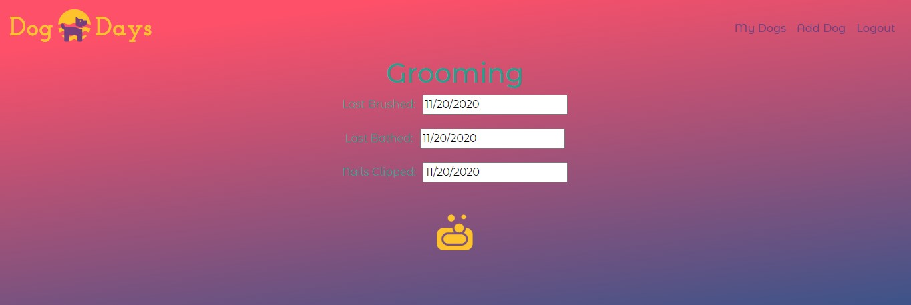

# Dog Days

## Front End Capstone
### Nashville Software School, Evening Cohort 12 

**Dog Days** Dog Days is the final project for the front-end class of NSS. It was created as a one stop app for a dog owner to be able to track a dog’s exercise, feeding, bathroom, and grooming.

## Features:
1. User Auth with Google. 
1. Displays the users dogs when logged in.
1. User can add their own dogs, includes name, age, breed, and photo.
1. User can update each category for each dog. 
1. Project uses HTML, sCSS, JS, Reactstrap, Moment JS, Datepicker, Firebase, Axios

## Screenshots:
#### User's Dogs: 

#### Dog Profile: 

#### Edit/Add Dog:

#### Food Update

#### Bathroom Update

#### Exercise Update

#### Grooming Update

## How to Run
>Deployed at: https://dog-days-763e0.web.app
